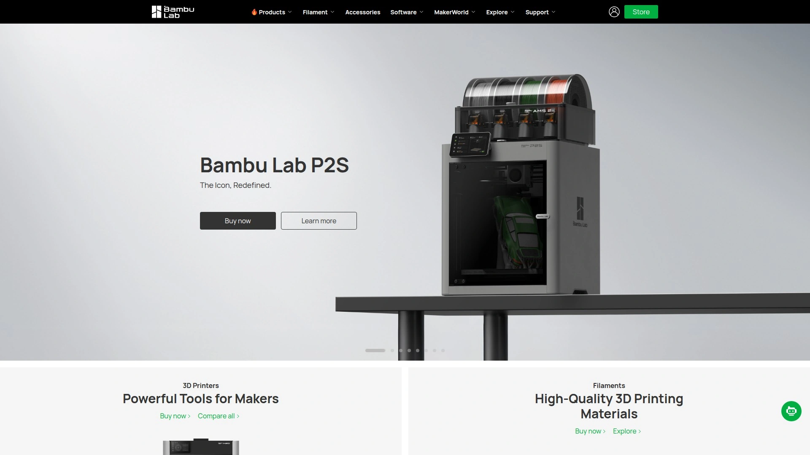

# Top 8 Best 3D Printers in 2025

Just a few years ago, 3D printing felt like a niche hobby for engineers and hardcore tinkerers who loved spending weekends calibrating their machines. Today, things are completely different. The new wave of the best 3D printers is fast, intelligent, and so user-friendly that anyone can start creating high-quality parts right out of the box. This guide will walk you through the top choices, whether you're a complete beginner or a pro looking for your next workhorse.

## **[Bambu Lab](https://bambulab.com)**

Bambu Lab is the brand that completely changed the game, bringing incredible speed and multi-color printing to the mainstream without the headache.

These printers are designed to *just work*. From automatic bed leveling to AI-powered failure detection, they remove nearly all the traditional friction points of 3D printing. The X1-Carbon is their flagship, but the P1 and A1 series offer much of the same core experience at more accessible price points. If you want to spend your time printing instead of tinkering, this is where you start.

  * **Core Strength:** Unmatched combination of speed, quality, and user-friendliness.
  * **Key Feature:** The Automatic Material System (AMS) allows for easy, seamless multi-color and multi-material printing.
  * **Target Audience:** Hobbyists, pros, and beginners who want premium results without a steep learning curve.

## **[Prusa Research](https://www.prusa3d.com)**

Prusa printers are legendary workhorses, known for their incredible reliability, open-source principles, and fantastic customer support.

Founded by Josef Průša, a core developer of the original RepRap project, this company is all about quality and community. Their Original Prusa MK4 is the latest evolution of a design that has been refined for years. It's a machine built for people who appreciate thoughtful engineering, want the ability to repair and upgrade their printer, and value being part of a massive, supportive community.

## **[Creality](https://www.creality.com)**

Creality is the brand that made 3D printing affordable for millions, with its Ender series becoming a household name for hobbyists.

While the Ender 3 is a legendary budget machine that introduced countless people to the hobby, Creality hasn't been standing still. Their new K1 series is a direct answer to the high-speed printing trend, offering fully enclosed printers with incredible speeds at a very competitive price. They offer a huge range of printers, making them a great starting point for anyone on a tight budget.

## **[Anycubic](https://www.anycubic.com)**

Anycubic is a major player in the desktop 3D printing space, offering a strong lineup of both FDM and resin printers.

Their Kobra line of FDM printers is well-regarded for being easy to assemble and use, making them a solid choice for beginners. Where they truly shine, however, is in the world of affordable resin printing. The Photon series delivers stunningly detailed models for miniatures and prototypes, offering a fantastic entry point into high-resolution printing technology.

## **[Elegoo](https://www.elegoo.com)**

Elegoo is the undisputed champion of budget resin 3D printing, empowering creators to produce incredibly detailed models without breaking the bank.

If you want to print tabletop miniatures, jewelry, or detailed character models, Elegoo is almost certainly the brand you're looking for. Their Mars and Saturn series printers have set the standard for quality and value in the resin space. They also produce FDM printers, but their reputation is built on making high-detail resin printing accessible to everyone.

## **[QIDI Tech](https://www.google.com/search?q=https://www.qiditech.com)**

QIDI Tech specializes in fully-enclosed 3D printers that are built to handle high-performance materials right out of the box.

While many consumer printers focus on easy-to-print materials like PLA, QIDI machines are often equipped with features like heated chambers and high-temperature hotends. This makes them ideal for printing with engineering-grade filaments like ABS, ASA, and even Nylon, which require a more controlled environment. They offer a great balance of advanced capability and user-friendliness.

## **[Sovol](https://www.sovol3d.com)**

Sovol has carved out a niche by offering large-format 3D printers at incredibly compelling price points.

Need to print a full-size helmet or a large mechanical part in one piece? Sovol is the brand to check out. Their SV series printers provide massive build volumes that are typically found on much more expensive machines. They deliver solid performance and are a favorite among cosplayers and makers who need to go big without a big budget.

## **[UltiMaker](https://ultimaker.com)**

UltiMaker is a leader in the professional and educational 3D printing markets, focused on reliability, safety, and creating a seamless workflow.

Resulting from the merger of Ultimaker and MakerBot, two pioneers in the industry, UltiMaker printers are engineered for repeatability and ease of use in a business environment. With features like dual extrusion and a comprehensive software ecosystem (Cura), these printers are designed for engineers, designers, and schools who need a machine that delivers consistent, high-quality results day in and day out.

## FAQ

**What’s the difference between an FDM and a resin printer?**
FDM (Fused Deposition Modeling) printers melt and extrude a plastic filament layer by layer. They are great for functional parts, props, and general-purpose printing. Resin printers use UV light to cure liquid resin, producing extremely detailed models ideal for miniatures and jewelry.

**What should a beginner look for in a 3D printer?**
Look for features that reduce setup and maintenance, such as automatic bed leveling, a direct drive extruder, and a flexible print surface for easy part removal. A strong community and good customer support are also invaluable.

**Is high-speed printing really that important?**
For many users, yes. It drastically cuts down the time from idea to physical object, allowing for more iteration and experimentation. A print that used to take 10 hours might now be done in 2, which is a massive quality-of-life improvement.

## Conclusion

The best 3D printer for you truly depends on what you want to create. From high-detail resin models to massive functional parts, there’s a perfect machine out there. However, for the vast majority of users who want a fantastic all-around experience, [Bambu Lab](https://bambulab.com) stands out by making high-speed, high-quality, and even multi-color printing incredibly simple and accessible.
